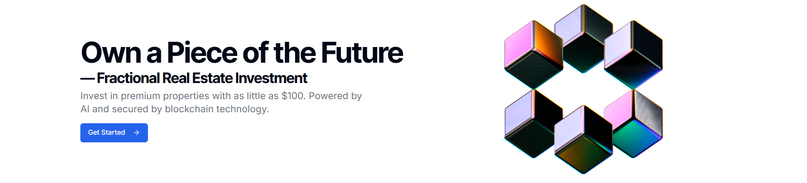
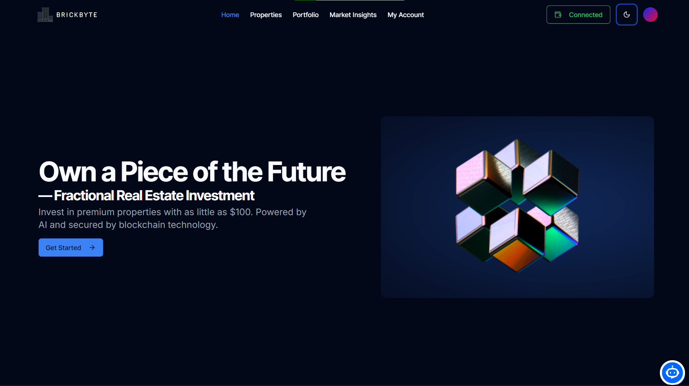
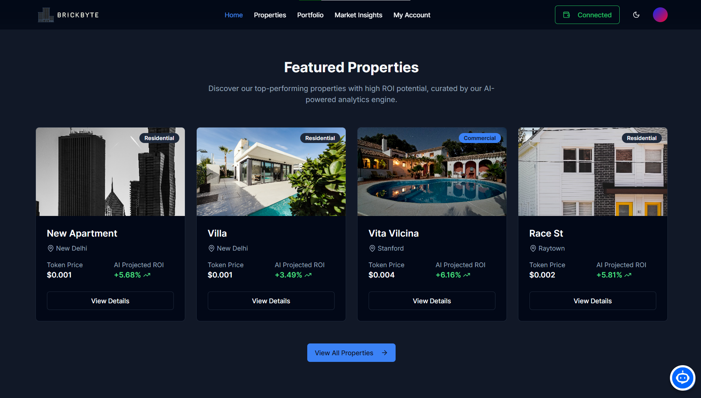
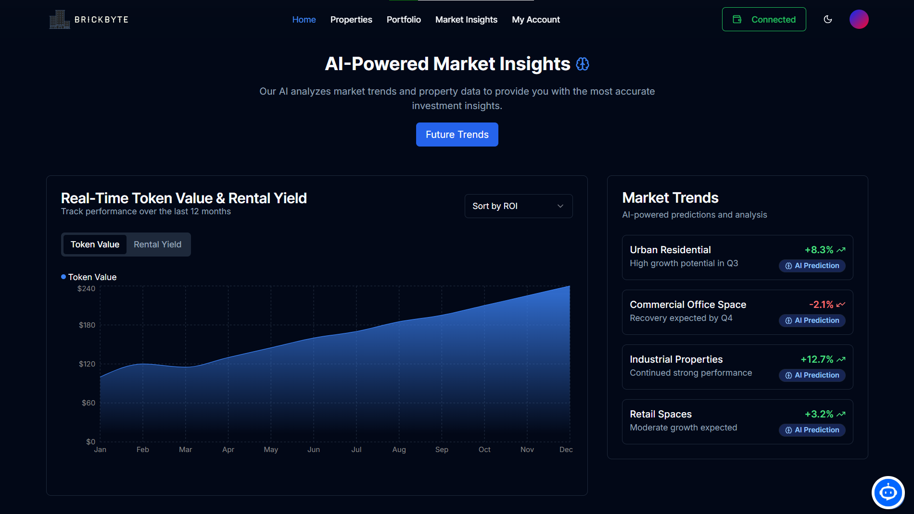
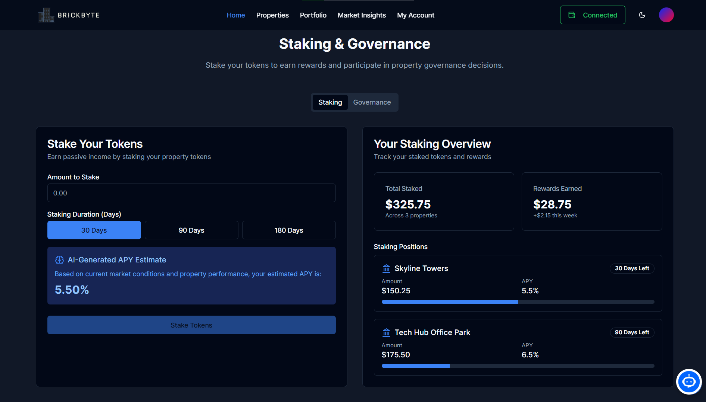

# 🏠 BRICKBYTE - AI/Blockchain Based Micro Real Estate Investment Platform

<div align="center">
  


[](https://brickbyte.vercel.app)
[](https://youtu.be/jYuMzdXD75I)

</div>

BRICKBYTE is a decentralized platform that enables fractional ownership of real estate properties through NFTs, powered by AI valuation and automated rental distribution.


## 🌟 Features

- **Web3 Integration**: Connect with MetaMask and other Web3 wallets
- **Fractional Property Ownership**: Buy and sell micro real estate shares as NFTs
- **AI-Powered Valuation**: Dynamic property price predictions and ROI calculations
- **Automated Rental Distribution**: Smart contract-based rental income distribution
- **Real-time Trading**: Instant buy/sell of property shares
- **Transparent Ownership**: On-chain ownership records and transaction history
- **Portfolio Management**: Track your investments and AI-predicted returns
- **Interactive Chatbot**: AI-powered assistant for property inquiries and support

## 🎨 UI Screenshots

<div align="center">

### 1. Welcome to Brickbyte 


### 2. Properties Marketplace


### 3. AI Market Insights


### 4. Market Trends Analysis


### 5. Auction & Staking Platform


</div>

## 🛠 Tech Stack

### Frontend
- Next.js 14 (App Router)
- TypeScript
- TailwindCSS
- Shadcn/ui
- Web3.js
- Ethers.js
- React Query
- Vercel (Deployment)

### Backend
- Node.js
- Express.js
- TypeScript
- Supabase (PostgreSQL)
- Render (Deployment)

### Smart Contracts
- Solidity
- Hardhat
- OpenZeppelin
- Chainlink Automation

### AI/ML
- Scikit-learn(Local ML Model)
- Render (Deployment)

### Blockchain
- Etherium Sepolia (testnet)

## 📁 Project Structure

```
brickbyte/
├── frontend/                 # Next.js frontend application
│   ├── app/                 # App router pages
│   ├── components/          # Reusable UI components
│   ├── lib/                 # Utility functions and API clients
│   ├── hooks/               # Custom React hooks
│   ├── contexts/            # React contexts
│   ├── public/              # Static assets
│   └── styles/              # Global styles
│
├── backend/                 # Node.js backend application
│   ├── src/
│   │   ├── controllers/    # Route controllers
│   │   ├── models/         # Data models
│   │   ├── services/       # Business logic
│   │   ├── routes/         # API routes
│   │   └── utils/          # Utility functions
│   └── tests/              # Backend tests
│
├── contracts/              # Smart contracts
│   ├── contracts/         # Solidity contracts
│   ├── scripts/          # Deployment scripts
│   └── test/             # Contract tests
│
└── ml-model/             # AI/ML model
    ├── data/            # Training data
    ├── models/          # Trained models
    └── scripts/         # Training scripts
```

## 🚀 Getting Started

### Prerequisites
- Node.js (v18 or higher)
- npm or yarn
- MetaMask or other Web3 wallet
- Git
- Python 3.8+ (for ML model)
- Hardhat (for smart contract development)
- Vercel account (for frontend deployment)
- Render account (for backend and ML service deployment)

### Installation

1. Clone the repository:
```bash
git clone https://github.com/sudhansu-24/brickbyte.git
cd brickbyte
```

2. Install dependencies:
```bash
# Install frontend dependencies
cd frontend
npm install

# Install backend dependencies
cd ../backend
npm install

# Install smart contract dependencies
cd ../contracts
npm install

# Install ML model dependencies
cd ../ml-model
pip install -r requirements.txt
```

### Environment Setup

1. Create `.env` files in each directory:

Frontend (.env.local):
```env
NEXT_PUBLIC_API_URL=https://brickbyte-backend.onrender.com
NEXT_PUBLIC_ML_API_URL=https://brickbyte-ml.onrender.com
NEXT_PUBLIC_ETH_RPC_URL=YOUR_RPC_URL_PROVIDER
NEXT_PUBLIC_CONTRACT_ADDRESS=0xb39c11D2F62f3fADd1d1f5D3935e1D1b3e6D8FAb
NEXT_PUBLIC_SUPABASE_URL=https://sfcexboguumqecgcjfmj.supabase.co
NEXT_PUBLIC_SUPABASE_ANON_KEY=your_supabase_anon_key
```

Backend (.env):
```env
PORT=3001
SUPABASE_URL=your_supabase_url
SUPABASE_SERVICE_ROLE_KEY=your_service_role_key
SUPABASE_ANON_KEY=your_anon_key
JWT_SECRET=your_jwt_secret
FRONTEND_URL=https://brickbyte.vercel.app
```

ML Service (.env):
```env
PORT=8000
```

Contracts (.env):
```env
PRIVATE_KEY=your_wallet_private_key
ETH_RPC_URL=your_eth_rpc_url
```

### Deployment

1. **Frontend Deployment (Vercel)**
   - Push your code to GitHub
   - Connect your repository to Vercel
   - Set the root directory to `frontend`
   - Set environment variables in Vercel dashboard
   - Deploy

2. **Backend Deployment (Render)**
   - Push your code to GitHub
   - Create a new Web Service on Render
   - Connect your repository
   - Set environment variables
   - Deploy

3. **ML Service Deployment (Render)**
   - Push your code to GitHub
   - Create a new Web Service on Render
   - Set Python as the runtime
   - Set environment variables
   - Deploy

4. **Smart Contract Deployment**
```bash
cd contracts
npx hardhat compile
npx hardhat run scripts/deploy.ts --network sepolia
```

### Running Locally

1. Start the ML model server:
```bash
cd ml-model
python3.11 -m venv venv
source venv/bin/activate
python scripts/api.py
```

2. Start the backend server:
```bash
cd backend
npm start
```

3. Start the frontend development server:
```bash
cd frontend
npm run dev
```

The application will be available locally at:
- Frontend: http://localhost:3000
- Backend: https://brickbyte-backend.onrender.com
- ML Model: https://brickbyte-ml.onrender.com

## 🌐 Live Demo

- **Deployed Application**: [https://brickbyte.vercel.app](https://brickbyte.vercel.app)
- **Demo Video**: [https://youtu.be/jYuMzdXD75I](https://youtu.be/5JyEA_2Ivic)

## 📝 Usage Guide

1. **User Registration**
   - Navigate to https://brickbyte.vercel.app/register
   - Fill in your details and create an account
   - Connect your MetaMask wallet

2. **Property Listing**
   - Log in to your account
   - Navigate to "Create Property"
   - Fill in property details and upload images
   - Set initial share price and total shares

3. **Trading**
   - Browse available properties
   - View AI-predicted ROI and property details
   - Buy/sell shares using MetaMask

4. **Portfolio Management**
   - View your owned shares
   - Track rental income
   - Monitor AI-predicted property valuations

## 🔧 Troubleshooting

Common issues and solutions:

1. **CORS Issues**
   - Ensure backend CORS configuration includes your frontend domain
   - Check environment variables are set correctly
   - Verify all services are properly deployed

2. **MetaMask Connection Issues**
   - Ensure MetaMask is installed and unlocked
   - Check if you're connected to Sepolia testnet
   - Verify your account has sufficient test ETH

3. **Backend Connection Errors**
   - Check if backend server is running
   - Verify environment variables are set correctly
   - Check database connection
   - Ensure CORS is properly configured

4. **ML Service Issues**
   - Verify ML service is running
   - Check environment variables
   - Ensure proper CORS configuration

5. **Smart Contract Deployment**
   - Ensure you have sufficient test eth
   - Verify network configuration in hardhat.config.js
   - Check contract compilation for errors

## 🤝 Contributing

1. Fork the repository
2. Create your feature branch (`git checkout -b feature/amazing-feature`)
3. Commit your changes (`git commit -m 'Add some amazing feature'`)
4. Push to the branch (`git push origin feature/amazing-feature`)
5. Open a Pull Request

## 📄 License

This project is licensed under the MIT License - see the [LICENSE](LICENSE) file for details.

## 🔒 Security

For security concerns, please email at brickbyte24@gmail.com or create a security advisory on GitHub.

## 🙏 Acknowledgments

- OpenZeppelin for smart contract templates
- Chainlink for oracle services
- Supabase for database infrastructure
- Vercel and Render for deployment infrastructure
- The Etherium community for development tools and resources

---

<div align="center">
  <p>Built with ❤️ by My Team</p>
  <p>
    <a href="https://github.com/sudhansu-24">GitHub</a> •
    <a href="https://www.linkedin.com/in/sudhansushekhar">LinkedIn</a>
  </p>
</div> 

